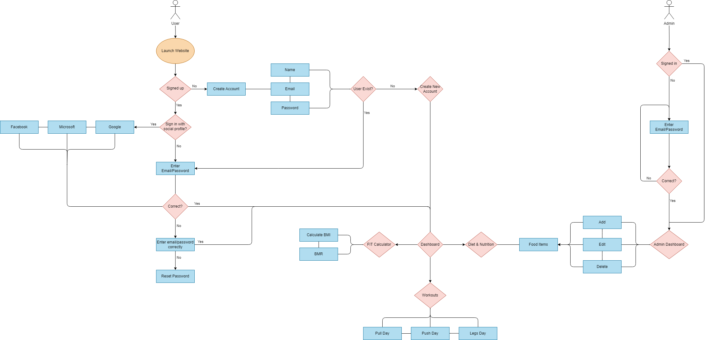

# CS346 Project

This is a full-stack web application built for the CS346 course. The front-end is developed using HTML, CSS, JavaScript, and EJS (Embedded JavaScript) templating engine, while the back-end is built with Node.js, Express.js, and MongoDB, other dependencies (as listed in your package.json).

## Overview

This website is a fitness and health application called FITME that provides users with a platform to manage their fitness goals and maintain a healthy lifestyle. One of the key features of this application is its user authentication system, which allows users to create an account and log in using either local credentials (email and password) or their existing social media accounts (Google, Facebook, and Microsoft).

## Flow Chart



**Local Login**
Users can create a new account by providing their email address and setting a secure password.

**Social Logins**
For added convenience, users can choose to authenticate using their existing Google, Facebook, or Microsoft accounts. 

**User Dashboard**

Once authenticated, users gain access to a dashboard that provides the following functionalities:

1. **BMR and BMI Calculator**
   Users can input their personal information, such as age, height, weight, and activity level, to calculate their Basal Metabolic Rate (BMR) and Body Mass Index (BMI). These metrics provide valuable insights into their daily caloric needs and overall body composition, enabling users to make informed decisions about their fitness and dietary goals.

2. **Workout Plan**
   The application offers a workout planning feature, gives users exercise routines everyday. Users can choose from a wide range of exercises. The workout plan section also provides access to instructional videos and guides to ensure proper form and technique.

3. **Diet Meals Plan**
   Maintaining a balanced and nutritious diet is essential for achieving fitness goals. The diet meals plan feature helps users plan their meals in advance by providing access to a database of healthy meal plans.

Overall, this website aims to provide users with solution for managing their fitness journey. By combining user authentication with features like BMR and BMI calculators, workout planning, and diet meal planning.

## Features

- User authentication (local and social logins)
  - Local login with email and password
  - Social logins (Google, Facebook, Microsoft)
- User dashboard
    - BMR, BMI calculator
    - Workout plan
    - Diet meals plan

## Prerequisites

Before you can run this application, you need to have the following software installed on your machine:

- Node.js (v12 or later)
- npm (Node Package Manager, comes bundled with Node.js)
- MongoDB (or a MongoDB Atlas cluster)

## Installation

1. **Clone the repository:**
```
git clone https://github.com/MushalMohammed1/my-website.git
```
2. **Navigate to the project directory:**
```
cd my-website
```
3. **Install the dependencies:**
```
npm install
```
4. **Create a .env file in the project root directory and add the following environment variables:**
```
MONGODB_URI=<your_mongodb_uri>
SESSION_SECRET=<your_session_secret>
GOOGLE_CLIENT_ID=<your_google_client_id>
GOOGLE_CLIENT_SECRET=<your_google_client_secret>
GOOGLE_CALLBACK_URL=<google_callback_url>
FACEBOOK_CLIENT_ID=<your_facebook_CLIENT_id>
FACEBOOK_CALLBACK_URL=<facebook_callback_url>
FACEBOOK_CLIENT_SECRET=<your_facebook_CLIENT_secret>
MICROSOFT_CLIENT_ID=<your_microsoft_client_id>
MICROSOFT_CLIENT_SECRET=<your_microsoft_client_secret>
MICROSOFT_CALLBACK_URL=<microsoft_callback_url>
```
Replace the placeholders with your actual values.

## Running the Application
To start the application, run the following command:
```
node app.js
```
or
```
npm start
```
This will start the Node.js server and make the application available at http://localhost:5000 (or any other port specified in the code).

Based on the provided code, the following technologies and libraries were used in this project:

## Technologies used

**Front-end Technologies:**
- HTML
- CSS
- JavaScript
- EJS (Embedded JavaScript Templating)

**Back-end Technologies:**
- Node.js
- Express.js

**Database:**
- MongoDB

**Other Dependencies and Libraries:**
- dotenv: For loading environment variables from a `.env` file.
- express-ejs-layouts: For implementing layouts and partials in EJS templates.
- method-override: For allowing HTTP verbs such as PUT and DELETE in places where the client doesn't support it.
- connect-mongo: For storing Express sessions in MongoDB.
- express-session: For managing user sessions.
- passport: For authentication middleware.
- passport-google-oauth20: For Google OAuth2.0 authentication strategy.
- passport-facebook: For Facebook authentication strategy.
- passport-microsoft: For Microsoft authentication strategy.
- bcrypt: For hashing and salting passwords.
- mongoose: For MongoDB object data modeling.

The project follows the Model-View-Controller (MVC) architectural pattern, with EJS as the templating engine for rendering views, and Express.js as the web application framework for handling routes and middleware.

The application uses MongoDB as the database for storing user data and session information. It also implements user authentication using Passport.js, supporting local authentication (email and password) and social logins (Google, Facebook, and Microsoft).

The project utilizes environment variables through the `dotenv` library to store sensitive information like database connection strings and authentication credentials securely.

## Resources
Certainly! Here are some excellent resources for the technologies used in this project:

**Node.js**
- Official Documentation: https://nodejs.org/en/docs/
- Node.js Crash Course (Video): https://www.youtube.com/watch?v=fBNz5xF-Kx4

**Express.js**
- Official Documentation: https://expressjs.com/
- Express.js Crash Course (Video): https://www.youtube.com/watch?v=L72fhGm1tfE

**MongoDB**
- Official Documentation: https://docs.mongodb.com/
- MongoDB Crash Course (Video): https://www.youtube.com/watch?v=McqsSz5zOic

**Passport.js**
- Official Documentation: https://www.passportjs.org/docs/
**Other Resources**
- connect-mongo: https://github.com/jdesboeufs/connect-mongo
- express-session: https://github.com/expressjs/session
- bcrypt: https://github.com/dcodeIO/bcrypt.js

## Team Members

- **Abdullah Alahiadeb**
- **Mushal Alshagha**